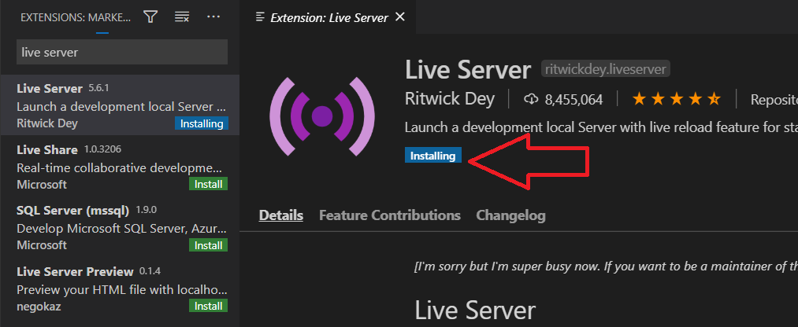

# **Final Assignment - FrontEnd 1**

This Markdown file will explain how this program works and how it was created. It will also mention possible future improvements, but to start with, it will explain how to get this program started.

## **Quick Start**

### **Step 1**

Download this repository by either forking it or clone it into to your own account. Open the repository in Visual Studio Code and download the extension "Live Server".

<p></p>

### **Step 2**

Open index.html with Live Server.

## Program description

On the starting page when opening the index.html file the user will have the option to choose between four different options.

1. Register a new member 
2. Check members
3. Create groups
4. README.md

### **1. Register a new member**

When the user choose to "Register a new member" they will be redirected to a form where they can input information about a new member. 

### **3. Check members**


### **3. Create groups**

When the user choose to "Create groups", they will be redirected to a page where they have the option to choose which premises the groups should be based on. 

### 4. README.md


### Problemformulering (dokumentera problem)
Formulera ett eller flera problem som du tänker lösa, med egna ord. Problemformuleringen får gärna bli teknisk, men ska utgå från en läsare som inte har några kunskaper om kod. Det går även bra att rikta sig till en läsare inom ett speciellt område (specialintressen, yrken, barn, eller vad som helst). Utgå från en potentiell läsare med minimala förkunskaper och förtydliga och fördjupa dig i det tekniska successivt. 

Det går bra att hålla sig till exemplet med att skapa upp grupper av studenter baserat på den data de (ni) själva lämnat ifrån er. En problemformulering skulle då kunna bestå av tre paragrafer text

1. Problemet beskrivet i allmänhet. Till en läsare som inte arbetar eller studerar på Nackademin.
2. De specifika förutsättningar och utmaningar som är utgångspunkten för den här lösningen.
3. Hur ni avser lösa problemet med kod. Det går även bra att argumentera för att problemet inte ska lösas med kod.

Använd www/dev/index.html som startpunk. Det går bra att skapa undersidor och länka dem. Alla sidor utgår från mappen "www/dev" och alla länkar kan göras relativa till den. Filer från data-mappen hämtas via api. Se exempel i script.js. Det behövs alltså bara en script.js om man vill återanvända den på alla sidor (det vill man förmodligen).
```
    www/dev
          |- index.html
          |- script.js
          |- example
             |-index.html
          |- about
             |-index.html
```
```html
    <a href="/">Start</a>
    <a href="/example/">Exempel</a>
    <a href="about">Info</a>
    ...
    <script src="/script.js"></script>
```

### Lös problemet
Skriv kod som löser problemet du formulerat ovan. Lösningen ska kunna demonstreras på index.html eller någon undersida genom att köra kod skriven i javascript. Utgå från script.js, men det går bra att skapa ytterligare filer, och att skriva javascript i script-taggar direkt på sidorna, om det fungerar bäst. Kommentera koden så att en kollega kan följa vad som händer när koden körs. Utgå från din egen kunskapsnivå när du skriver kommentarer. 

### Teknisk dokumentation
Byt ut filen README.md till en fil du skrivit själv. Syftet med den tekniska dokumentationen är att beskriva vad din kod gör, och hur en annan utvecklare kan göra för att använda din lösning. Utgå från din egen kunskapsnivå och försök inleda med en så kortfattad beskrivning som möjligt av problemet. Exempel:
_This code will create groups of users based on how compatible their respective zodiac-signs are._

Beskriv sedan vilka steg en utvecklare behöver gå igenom för att nå samma resultat, samt vilka delar (om några) som kan modifieras.

## Examination
Uppgiften lämnas in genom att examinatorn bjuds in till repot, samt att repot sparas som .zip-fil och lämnas in i studentportalen senast 19e oktober 2022, 23:59.


## Uppslag till alternativa problem att lösa
Om man inte vill fördjupa sig i gruppindelning går det bra att formulera ett eget problem och lösa det. Nedan finns några uppslag som man kan använda.
* Funktionen publishSecure i src/node/f_f_data/publish.js borde kunna användas till att skapa anonymiserad data. Kan man bygga ett gränssnitt för exemelvis kursutvärderingar med det?
* Går det att hacka filerna ovan, så att man kan ändra i dem utan att syns för upphovspersonen?
* Kan man använda teknik liknande highlight.js för att känna igen tekniska termer i exempelvis kursplanen?
* Kan man använda uppgifterna 1-18 och skapa ett sätt för studenter att slutföra uppgifterna och sedan be en annan student att granska sin lösning? Som ett sätt att hålla koll på hur man ligger till kunskapsmässigt.
